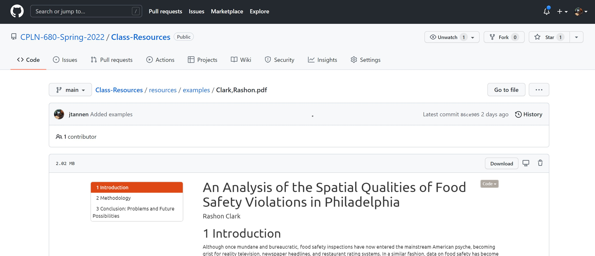

## Welcome!

- Intro 
- Syllabus (30 min)
- *10 minute break*
- Breakouts (45 min)
- *10 minute break*
- Presentation: The Turnout Tracker (60 min)

---

## The Capstone Project
The final project is an...

- independent study
- on a substantive question
- using GIS data

*I'm here to help, but ultimately you are responsible for driving and executing your project.*

--- 

## Possible project deliverables

* Research paper on a topical question
* Research paper on GIS methodology
* Dashboard*
* GIS tool

---

## Examples from past years

* Spatial analysis of food safety violations in Philadelphia
* Spatial methods for heritage preservation
* Latitudinal shifts of grass plant functional types
* Evaluating two-seat rides for SEPTA  

---

## Project components

* Final deliverable.
* Presentation to the class.
* Complete GitHub repository* with raw data, processed data, outputs.

---

## GitHub

This course will use GitHub as its primary site.  

* https://github.com/CPLN-680-Spring-2022/Class-Resources
* Final project submitted as a GitHub Repo.

*This is my first time using GitHub to teach, so will be flexible.*

---

## Course time

* Working groups on projects
* Student presentations
* External speakers, "Anatomy of a project"
* Lectures on Spatial Methods, Better Engineering for Researchers 

---

## A note on technical requirements

My approach to programming is practical. 

- You only ever need "good enough," and there will always be someone more expert.
- You will see enormous gains (errors, iteration speed) by improving your engineering 20%.
- Push yourself in reasonable directions for final project.
- The most important thing is to overcome 0 $\rightarrow$ 1, teach you how to learn for yourself.

---

## A survey

Do you plan on using... 

- ESRI
- R
- Python
- Something else

---

## A survey

What is your familiarity with...  

- Git & GitHub
- Command line
- Spatial Econometric methodologies (e.g. "autoregression")

What other GIS topics would you like to learn?

---

## A survey

How confident are you in your idea for project?  

1 - Not confident at all.  
5 - I know exactly what I want to do.

---

## A note on the calendar

The calendar is aggressive at the beginning to discover blockers.

*NOTE: This is the first time I'm teaching this course, so what follows may be tweaked based on how things go. I promise one week's notice before any changes.*

---

## Calendar

| Date | Assignment Due (Tentative)|
|-|--|
|Jan 14| Initial Topic Brainstorm |
|Jan 21| Project Proposal 0 |
|Jan 28| GitHub Repo |
|Feb 4| Data Summary Analysis, Presentations A |
|Feb 11| Project Proposal 1, Presentations B | 
|Feb 25| Mid-point Work In Progress Report, Presentations A |
|March 4| Feedback for 2 peer projects. Presentations B |
|March 11| *Spring Break* | 
|March 25| Peer Code Review | 
|April 15| Final Presentation (1) | 
|April 22| Final Presentation (2) | 
|April 29| *No Class*, Final Projects due |

---

## Assignments

**syllabus.Rmd** will be source of truth.

TBD how to submit assignments; either GitHub, Canvas, or email.

---

## Details

Office Hours: Wednesday 6-8pm, by appointment  
  
Sign up on Calendly: https://calendly.com/jtannen/office-hours

---

## Grading

- Final Project 50%
- Final Presentation 25%
- Assignments & Participation 25%

--- 

## Next Week

- Due: Project Proposal 0
- In class: GitHub

---

## Next Week

**01-21 Project Proposal 0**: Two-page (or less) document with   

* Motivation
    * Is your project answering a question or solving a task? 
    * Is your question causal or descriptive?
    * (Brief) Summary of existing relevant research
* Datasets identified
* High-level summary of methods
* Describe deliverables
    * How will this be used? Describe a hypothetical user journey.
        * If a research paper, what will be the policy implications?
        
Submit via email, Canvas, or GitHub.

---

## Questions?

---

## Breakouts

In groups of three...

- 15 min: Overview your projects
    - What is the question you're trying to answer?
    - What data sources are available?
    - What is your most important next step?
- In 15 min, come back to this room.
