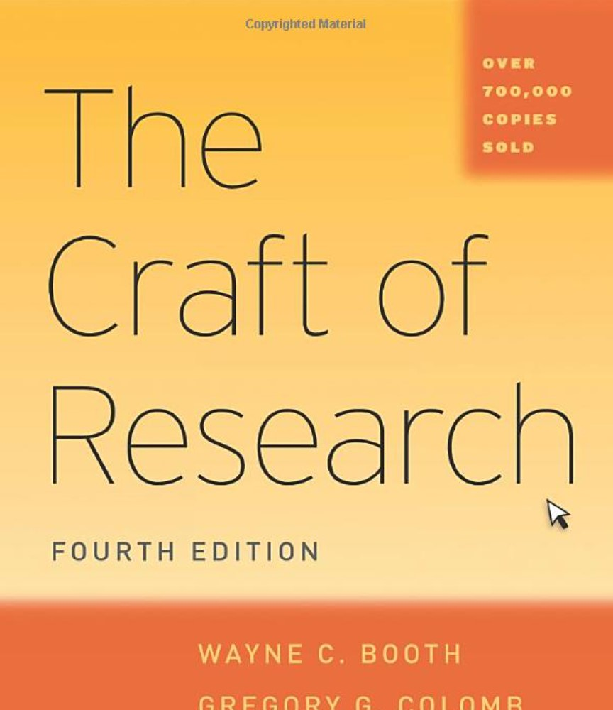
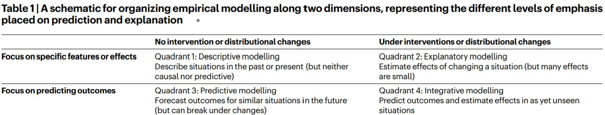

## Agenda

- From Topic to Question (1.25 hours)
- Break (0.25 hours)
- Git & Github (1 hour)

## From Topic to Question

How do you take a broad topic, and narrow it down to an answerable question?

{width=200}

-----

## From Topic to Question

Ask a **question** that solves a **problem** that you can convince readers to care about.

Possible question types:

- **Disagreement**: Some people think X, but other people think Y.
- **Structure and Composition**: What patterns exist? What typologies?
- **Claim**: Unmeasured claim about how things work.
- **Optimization**: Can we do this better?

-----

## From Topic to Question

Avoid questions that are...

- Settled fact (you could look them up)
- Unanswerable with data
- Answers are dead ends

-----

## Is your question answerable with data?

Think about your question and your final product. Will it answer the question? What will skeptics say?

- Is your question to broad to have an "answer"?
- What would the ideal dataset look like?
- What will a skeptic say?
- State a possible finding: "I find that an increase of X is correlated with an increase of Y..."

-----

## What kind of question do you have?

From Hofman, J.M., Watts, D.J., Athey, S. et al. Integrating explanation and prediction in computational social science. Nature 595, 181–188 (2021).
&nbsp; &nbsp; 

{width=100%}

-----

## From Topic to Question

Ask your question in the following form...

1. Name your topic: "I am studying ____."
1. Add your question: "I want to know ____ because ____."
    a. This is a (prediction, feature) question that assumes (no intervention, yes intervention).
1. Add an example finding: "A possible finding is ____. My data is capable of showing that because ____."
1. Implication: "A hypothetical way my result will be used is ____."

-----

## Think, Pair, Share

1. 10 min: Individually write your question in the form of the prior slide.
1. 30 min: In groups, share your question and proposal. Group members, critically ask:
    a. Is this question answerable with data?
    a. Would the proposed analysis convince a skeptic?
    a. Would the result be useable?
1. Come back, share out results.

-----

## Assignments

- Next week, 1/28: GitHub Repo with raw data.
- 2/4: Data Summary Analysis and 7-minute Presentations (with 3-minute question).
- 2/11: Project Proposal 1.
