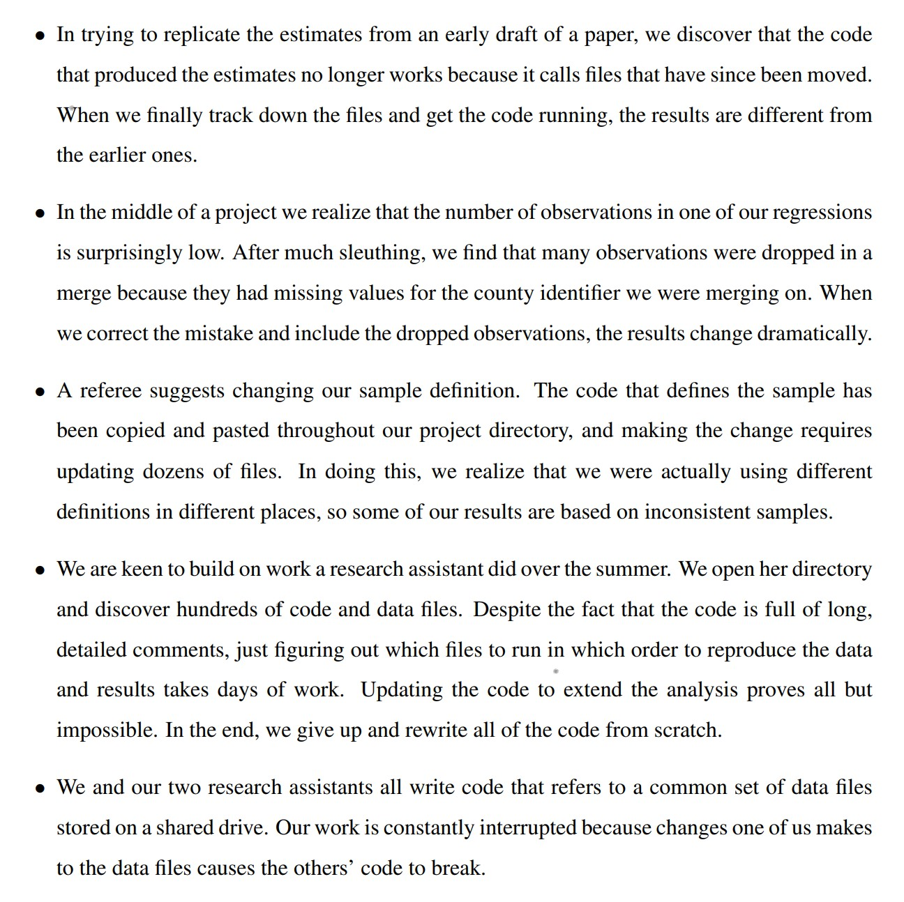

## Agenda

- Better Engineering: File Organization
- *10 minute break*
- Proposal and Data Presentations

---

## Today: Data Cleaning and File Organization

Inspired by:

- [Code and Data for Social Sciences, Gentzkow & Shapiro](https://web.stanford.edu/~gentzkow/research/CodeAndData.pdf)
- Clean Code, Martin

---

## What can go wrong? (from Gentzkow & Shapiro)

{height=95%}

---

## What is the answer?

Not working harder. Working smarter.

---

## Rules for Data Analysis

**Rule 1: Modularity.** Separate your workflow into steps. Each step gets its own script(s). Save outputs in between.

{width=100%}

---

## My original workflow

1. Download raw data
2. Clean it by hand
3. Gigantic script that reshaped the data, ran analysis, generated plots.
  a. Hard-coded assumptions hidden everywhere including settings, file locations, dates. 
  a. Saves a bunch of plots. Prints output.
4. Write report by hand.

---

## What does this mean?

- If something needs to change...
  1. Only I can do it.
  1. There are five different places that need to change. I will forget some of them.
  1. It takes a long time.
  1. Very high probability of breaking something or (worse) introducing correctness error.
  
  
---

## What is the answer?

**Modularity**

Also known as "Separation of Concerns" or "Single Responsibility Principle".

*"Separate an application into steps, with minimal overlapping functions between them and clear deliverables in between."*

---

## Modularity of data analysis

1. Download raw data.
1. Clean the data.
1. Conduct analysis.
1. Produce plots and tables.
1. Create report.

These should be separate scripts that save results. The next script only depends on the saved outputs of the last one.

---

## Why does this help?

Suppose you get next year's raw data, but the format has changed. 

All you need to do is munge the data to the same format as the last clean output!

The expectations are simple and well-defined.

---

## Raw Data

**Keep your raw data in a separate file. You *never* modify this directly.**

---

## Rules for Data Analysis

**Rule 2: Automation.** Automate everything that can be automated.

---

## Why automate?

1. Reproducible
1. Auditable
1. Reduces human error

---

## Non-obvious things to automate

1. Manually fixing data errors.
1. Copying files between locations.
1. Copying text from an output to a report.
1. Running scripts in the right order.

---

## Zooming out

Don't be overwhelmed! Do better than yesterday. Your future self will thank you.

---

## Zooming out

There will always be human interaction needed. But ask yourself, what's the current bottleneck of my time? The current riskiest part if someone else tried to run this?

---

## Confident Automation

Produce plots and outputs that make you confident in the results.

- Counts of data.
- Means and distributions.
- Maps and summary plots.

What do you look at when something goes wrong? Automate that!