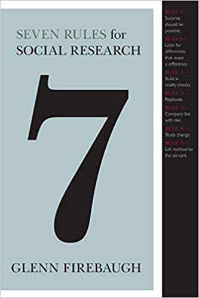

## Agenda

- Anatomy of a Project: Seth Bluestein and Michelle Montalvo
- *10 minute break*
- Presentations Group B

---

## Change to Calendar

- Next Friday (Feb 18): Proposal 1 due.
  - Might be largely the same as Proposal 0. 
  - Might be entirely different!
  - Please add initial data exploration results.
- Next two weeks in class: 50% Working groups.
- March 4: Mid-point draft due. *Work in Progress*.
- March 18 & 25: Mid-point draft presentations.

---

## Strategies for Questions?

Who is the audience for the research, and what will they use it for?

Some possibilities:

- Prioritization.
- Change funding.
- Prediction.

---

## Strategies for Questions?

Rule 2: Find differences that make a difference.

{height=50%}

---

## Strategies for Questions?

Rule 2: Find differences that make a difference.

- Compare apples-to-apples.
- Compare sizes of effects.
- Compare differences in space and time.

Exercise from class 2: Write a possible finding for your research. Does it answer your question? Is it compelling?

----

## Feedback from survey

- Working time for troubleshooting.
- Lecture on GIS methods.
  - Survey forthcoming.
  

