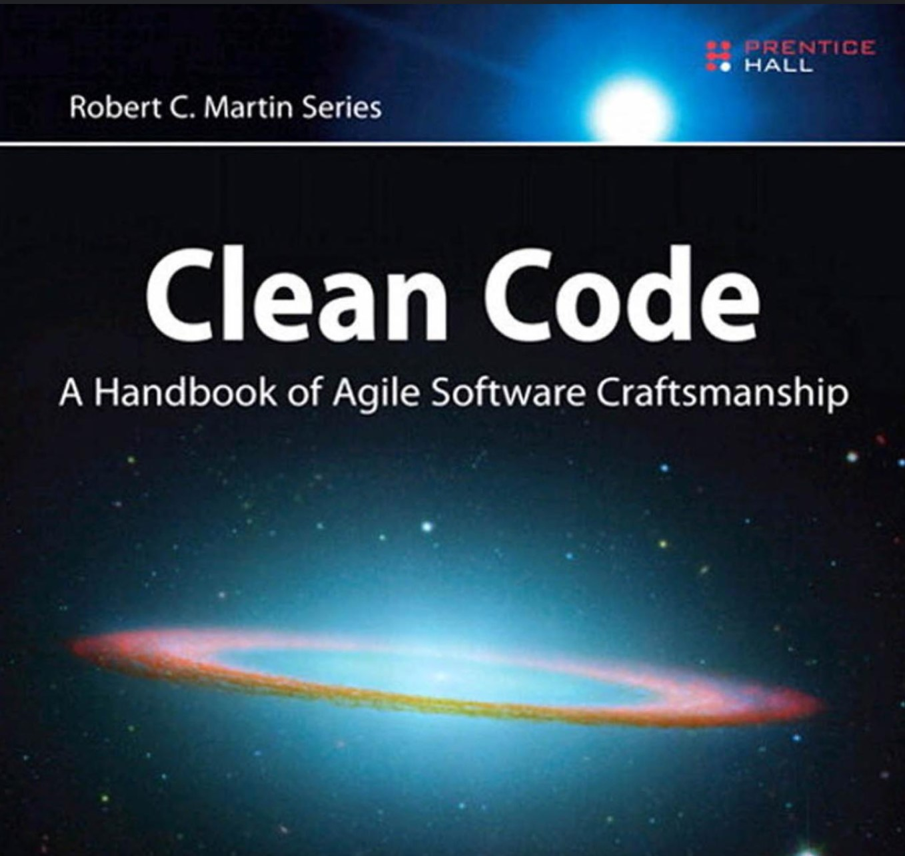

## Agenda

- Anatomy of a Project: Dan Lopez, Director of Software Engineering, OIT
- *10 minute break*
- Working Groups
- Better Engineering: Clean Functions

---

## Project Proposal 1

Please remember to *upload to your github repo*.

---

## Survey Results

---

## Working Groups

30 minutes

- A: GIS data wrangling in ArcMap
- B: GIS data wrangling in Python/R
- C: Building Interactive Tools / Markdown
- D: Using APIs / web tools
- E: Research question & statistical methods

Break into groups of 3.

Each person gets 10 minutes to discuss and actively debug.

---

## Clean Functions

Inspired by Clean Code (Martin) and R for Data Science (Grolemund & Wickham).

---

## Clean Functions

**Rule 1**: Do not copy code more than once.

aka "Don’t Repeat Yourself" aka "Single Source of Truth"

---

## Clean Functions

    df <- tibble::tibble(
      a = rnorm(10),
      b = rnorm(10),
      c = rnorm(10),
      d = rnorm(10)
    )
    
    df$a <- (df$a - min(df$a, na.rm = TRUE)) / 
      (max(df$a, na.rm = TRUE) - min(df$a, na.rm = TRUE))
    df$b <- (df$b - min(df$b, na.rm = TRUE)) / 
      (max(df$b, na.rm = TRUE) - min(df$a, na.rm = TRUE))
    df$c <- (df$c - min(df$c, na.rm = TRUE)) / 
      (max(df$c, na.rm = TRUE) - min(df$c, na.rm = TRUE))
    df$d <- (df$d - min(df$d, na.rm = TRUE)) / 
      (max(df$d, na.rm = TRUE) - min(df$d, na.rm = TRUE))

---

## Clean Functions

    my_rescale <- function(x) {
      rng <- range(x, na.rm = TRUE)
      (x - rng[1]) / (rng[2] - rng[1])
    }
    
    df$a <- my_rescale(df$a)
    df$b <- my_rescale(df$b)
    df$c <- my_rescale(df$c)
    df$d <- my_rescale(df$d)

---

## Clean Functions

    my_rescale <- function(x) {
      rng <- range(x, na.rm = TRUE)
      (x - rng[1]) / (rng[2] - rng[1])
    }
    
    for(column in c("a","b","c","d")){
      df[[column]] <- my_rescale(df[[column]])
    }
    
---

## Clean Functions

What was achieved?

    df <- tibble::tibble(
      a = rnorm(10),
      b = rnorm(10),
      c = rnorm(10),
      d = rnorm(10)
    )
    
    df$a <- (df$a - min(df$a, na.rm = TRUE)) / 
      (max(df$a, na.rm = TRUE) - min(df$a, na.rm = TRUE))
    df$b <- (df$b - min(df$b, na.rm = TRUE)) / 
      (max(df$b, na.rm = TRUE) - min(df$a, na.rm = TRUE))
    df$c <- (df$c - min(df$c, na.rm = TRUE)) / 
      (max(df$c, na.rm = TRUE) - min(df$c, na.rm = TRUE))
    df$d <- (df$d - min(df$d, na.rm = TRUE)) / 
      (max(df$d, na.rm = TRUE) - min(df$d, na.rm = TRUE))
      
---

## Clean Functions

What was achieved?

- Fewer mistakes, fewer places to change.
- Easier to understand.
- Clear SLA (Service Level Agreement)
- Encapsulation
- *Testable*.

---

## Do not copy code more than once

    df <- read.csv("C:/Users/Jonathan/papers/election_paper/data/data_2000.csv")
    election_metadata <- read.csv("C:/Users/Jonathan/papers/election_paper/data/elections.csv")
    candidates <- read.csv("C:/Users/Jonathan/papers/election_paper/data/candidates.csv")

    df$is_last_four_elections <- (ymd("2022-02-16") - ymd(df$date)) <= years(4)
    df$age <- (ymd("2022-02-16") - ymd(df$date))
    

---

## Do not copy code more than once: Globals

    DIR <- "C:/Users/Jonathan/papers/election_paper/" # also could setwd().
    DATA_DIR <- paste0(DIR, "data/")
    DATE <- "2022-02-16"

    df <- read.csv(paste0(DATA_DIR, "data_2000.csv"))
    election_metadata <- read.csv(paste0(DATA_DIR, "elections.csv"))
    candidates <- read.csv(paste0(DATA_DIR, "candidates.csv"))

    df$is_last_four_elections <- (ymd(DATE) - ymd(df$date)) <= years(4)
    df$age <- (ymd(DATE) - ymd(df$date))
    
---

## Do not copy code more than once: Globals

    DIR <- "C:/Users/Jonathan/papers/election_paper/" # also could setwd().
    DATA_DIR <- paste0(DIR, "data/")
    DATE <- "2022-02-16"

    data_path <- function(file) paste0(DATA_DIR, file)
    
    df <- read.csv(data_path("data_2000.csv"))
    election_metadata <- read.csv(data_path("elections.csv"))
    candidates <- read.csv(data_path("candidates.csv"))

    df$age <- (ymd(DATE) - ymd(df$date))
    df$is_last_four_elections <- df$age <= years(4)

---

## Other Function Rules

- Use good names.
  - Full words
  - Searchable
- Functions should be small.
  - Usually not more than 20 lines.
- Functions should do one thing. (Single Responsibility Principle)

---

## Small Functions

---

## Unit Testing?

Two types of tests:

- Unit Tests: Test a single function.
- Integration Test: Test the full end-to-end systems.

---

## Unit testing libraries

- R: `testthat`
- Python: `unittest`

Good unit tests...

- Test base use cases
- Test edge cases
- Test settings (treatment of NAs, missing)

