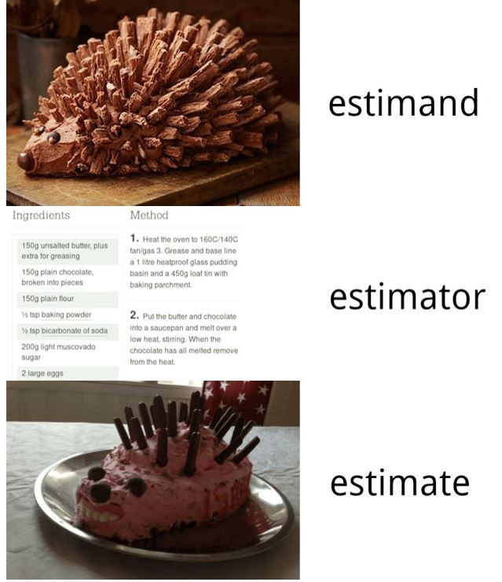
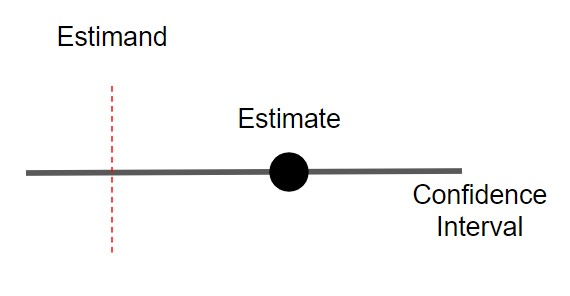
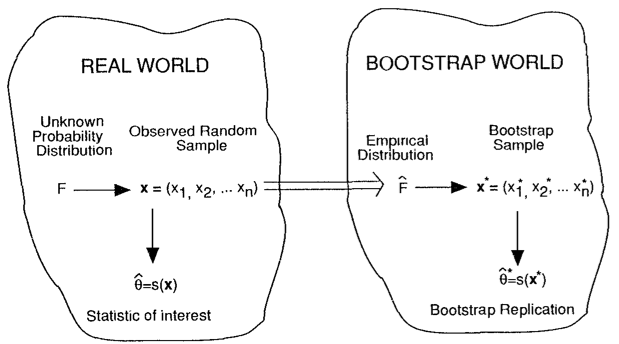

## Agenda

- Confidence Intervals
  - Analytic
  - Bootstraps
- Working Groups
- Looking Ahead

---

## A survey

Define...

- confidence interval
- estimand
- estimator

---

## Confidence Intervals

Some definitions:

- Random variable ($X$)
  - A function from real numbers to probabilities.
  - Usually denoted by capital latin letters.
  - Random variables have population properties, $P(X = 4)$, $E[X]$, $Var(X)$. These are normally denoted by greek letters ($\mu$, $\sigma$). \pause
- Population
  - The full group we wish to know about.
- Sample ($x$)
  - A random sample of $X$ from the population. 
\pause
- Estimand ($\mu$)
  - A "Population" value. (It's a statement about $X$, not $x$.)
  - This is the thing we care about.
\pause
- Estimate ($\bar{x}$)
  - This is itself a random variable.
  - This is what we observe.
\pause
- Estimator 
  - The formula for constructing an estimate.

---

## Estimators

---

## An example

We want to estimate the average height of Penn students. We draw five students at random. Their heights are 5.2, 4.8, 6.1, 5.0, 4.9 feet.

The Population: \pause All Penn students. \pause

The Random Variable: \pause The height of a randomly drawn student. \pause

The random sample: \pause These five heights. \pause

The estimand: \pause The population average height (E[X]). \pause  

The estimator: \pause The average of these five heights. \pause  

What can we say about the estimand given this estimator?

---

## A second example

We sample 100 U.S. cities. Among them, we estimate the correlation between segregation and income.

The Random Variable: \pause Each city's segregation and income. \pause

The random sample: \pause These 100 cities. \pause

The estimand: \pause The true correlation among all cities. \pause  

The estimator: \pause The sample correlation. \pause  

---

## The fundamental challenge of statistics

We do not observe the population, (e.g. any estimands). Instead we observe a single random sample. How can we say anything about the truth?

\pause
- We make assumptions about the population distribution.
- We can use math ("analytic") or computing ("bootstrapping") to say how likely it would be to see the data that we saw, given values of the population estimand.

---

## Confidence Intervals

**Confidence Interval**: An interval calculated on the sample such that, if you were to resample multiple times, they would cover the true estimand $\alpha$ fraction of the time.

For example, a 95% confidence interval should cover the true value 95% of the time across samples. (of course, we only ever see one.)

{width=50%}

---

## Confidence Intervals

Confidence intervals...

- are Random Variables themselves.
- *either cover or don't for one sample*
  - the probabilistic interpretation is over repeated samples.
- Can have better or worse precision.
- May rely on assumptions that are good or bad.

{width=50%}

---

## When you're estimating a model.

If you're having trouble thinking about your confidence intervals, ask yourself some of the following:

- What would it mean to draw another random sample of your data?
- What is your population that your sample is a subset of?

---

## A third example

We look at Philadelphia's 384 Census Tracts. Among them, we estimate the correlation between income and Covid cases.

The Random Variable: \pause Each tract's income and covid cases. \pause

The random sample: \pause These 384 tracts. \pause

The estimand: \pause ... \pause  

The estimator: \pause The sample correlation. \pause  

---

## Two methods to calculate confidence intervals

- Analytic
- Bootstrapping (computational)

---

## Analytic Confidence Intervals

Use math and assumptions to estimate what the variance of your estimator is.

For example:

- Suppose we want to know the mean $E[X]$. \pause
- We sample $N$ observations. \pause
- We choose the estimator $\bar{x} = \frac{1}{N} \sum_{i = 1:N} x_i$ \pause
- We can show that the variance of $\bar{X}$ is $Var(\bar{X}) = Var(X) / N$. \pause
- If we assume the Central Limit Theorem, then $\bar{X} \sim N(E[X], Var(X)/N)$ \pause
- Therefore, there is a 95% probability that $\bar{X}$ will be between $\mu_X - 1.96 \sqrt{Var(X)/N}$ and $\mu_X + 1.96 \sqrt{Var(X)/N}$. \pause
- So the interval $(\bar{x} - 1.96 \sqrt{Var(X)/N}, \bar{x} + 1.96 \sqrt{Var(X)/N})$ will contain $E[X]$ 95% of the time. \pause
- We can plug in the estimated value of $\widehat{Var(X)}$ (call it $\hat{\sigma}^2_X$), to get $(\bar{x} - 1.96 \hat{\sigma}_X/\sqrt{N}, \bar{x} + 1.96 \hat{\sigma}_X/\sqrt{N})$

---

## Analytic Confidence Intervals

Benefits

- Quick to compute once you've done the math.
- Well studied, well-known assumptions.

Drawbacks

- Need to do hard math if they aren't already solved.
- Assumptions may not hold.

---

## Bootstrapped Confidence Intervals

Efron (1979): 
- Instead of focusing $\bar{X}$ as our estimate, consider the whole sample $x$ as an estimate of the population distribution. ($\hat{F}(X)$)
- We can now actually sample infinitely many of our estimates, and look at their distribution.

---

## Bootstrapped Confidence Intervals

Percentile Bootstrap:

- Take your (single) sample of $N$.
- Construct your estimate $\hat{theta}$.
- For $N_{boot}$ times...
  - Resample $N$ items from your sample (with replacement).
  - Calculate $\hat{theta}_b$ on that sample.
- A 95% confidence interval is the 2.5th and 97.5th percentile of those bootstraps. 

---

## Percentile Bootstrap Confidence Intervals

Benefits

- Easy to calculate without math.
- Quite robust to skew in the data, complicated metrics.

Drawbacks

- Computationally intensive.
- Edge cases where they fail.

---

## The usefulness of Simulations

- You can "play god" by drawing many samples.
- Understand distributions and performance.
- Can test edge cases.

---

## Demo!

---

## Looking Ahead

- Sign-Ups: Mid-Point Presentation dates.
  - Will be assigned two peers to provide feedback.
  - Submit to Canvas. I will share with author.
  - I will share a prompt shortly.
- 03-18 Mid-Point Presentations A, Intro to Code Review
- 03-25 Review of two peer projects, Mid-Point Presentations B

---

## Working Groups

- In groups of 3...

  - Share the current state of your draft.
  - What is the state of your analysis?
  - What is your current blocker?
  - What is the current weakest link in your project?

Each person gets 10 minutes to discuss and actively debug.

---