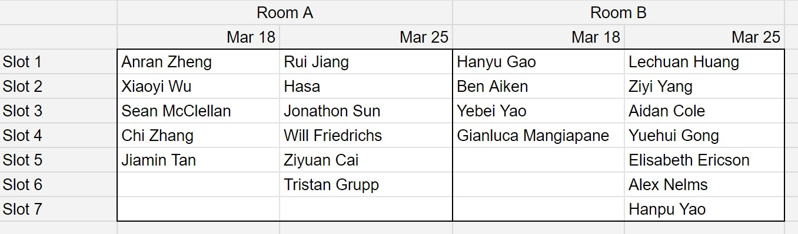

## Agenda

- Code Review
- Mid-Point Presentations

---

## Looking Ahead

Next Week: Peer Review of two projects.

April 1: Code Review (or Implementation Review) for two projects. Phila Dept of Public Health Presenting.

April 8: World Resources Institute Presenting.

April 15/22: Final Presentations

April 29: Final Project Due

---

## What is Code Review?

A second person looks at your code, makes suggestions.

Ideally, this happens with each commit.

[https://google.github.io/eng-practices/review/reviewer/](https://google.github.io/eng-practices/review/reviewer/)

---

## Why are *we* doing code review?

The single best way to improve your own code is to look at others'.

---

## What should you look for?

Remember, code is for humans! (Not computers!) Other people, or yourself in a year.

Is it easy to figure out...

a. Where to find things?
a. Where a given task is accomplished?
a. How to change or extend a feature?

---

## What should you look for?

a. **File organization and navigation** (can you find the important parts?)
a. **Correctness**
a. **Complexity** (can you easily understand what it's doing?)
a. Tests and Checks
a. Naming
a. Comments if necessary (why, not what)
a. Style (check out [Google Style Guides](https://google.github.io/styleguide/))
a. Good things

---

## On GitHub

**Issues**, **branches** and **Pull Requests**

\pause
**Issues** are how you request changes.

\pause
**branches** are separate workspaces to build a change. So far, you have probably only been working on the `main` branch.

\pause
**Pull Request** merges a branch with the `main` branch. This is where review happens.

---

## Demo

---

## For your review

You *can* leave comments in GitHub via issues, especially on individual lines.

\pause

Primarily, submit (via Canvas) a document with code review summary.

Focus on Zone of Proximal Development. Not everything will be perfect! What is the most important next thing to do?

---

## For your review

**File Organization**

- Is it easy to find what you are looking for?
- Are the files well-named?
- Is the README helpful?

**Code**

- Is it easy to understand what the code is doing?
- Is it modular? Do they repeat code?
- Are things well-named?

**Overall "Code-Smells"**

- Are you confident this code is error-free? Is it hard to tell?
- If you inherited this project tomorrow, would you be able to succeed with it?

---

## ArcMap?

Clone the directory. Open the file. Try to understand the analyses and systems.

- Does it look correctly implemented?
- Is it easy to figure out what is being done?

*Do your best, and help out your peer.*

---

## Presentations

10 minutes + 5 min Q&A

Room A: Here  
Room B: 323

