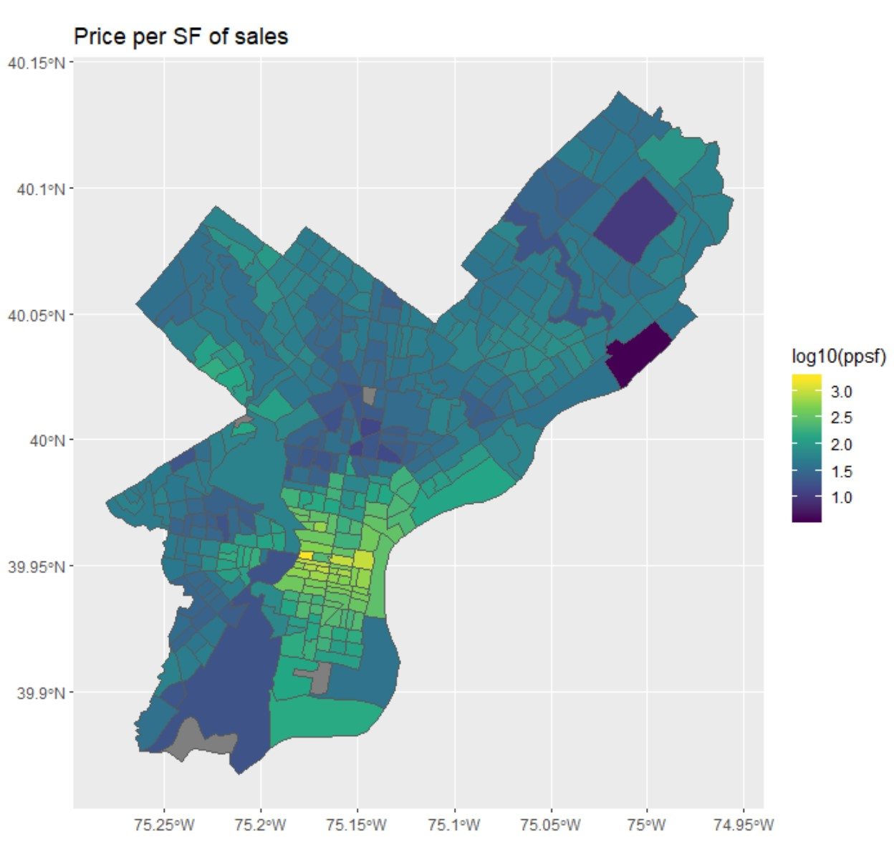
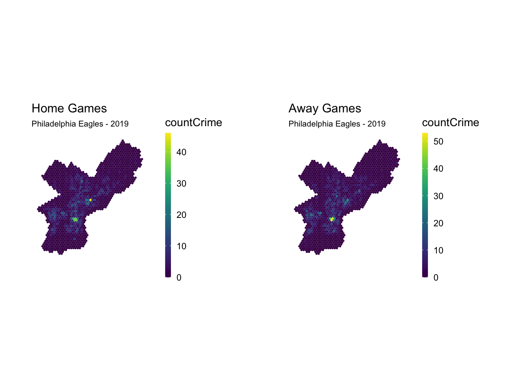

## Agenda

- Spatial Regressions
- Mid-Point Presentations

---

## Looking Ahead

Next Week: Code Review (or Implementation Review) for two projects. Phila Dept of Public Health Presenting.

April 8: World Resources Institute Presenting.

April 15/22: Final Presentations

April 29: Final Project Due

---

## High-Level notes from Mid-Points

- Use the Literature Review to help the reader understand why your topic is important.
  - Include the *findings* of the papers.
- Do a lot explaining the *why* behind your methods.
  - What is the purpose of your controls?
  - What is the challenge in your risk score?
- Include a lot more summary stats and overall plots of your data.
  - Don't jump into regression too soon! 

---

## Spatial Regressions

Consider the linear regression equation:

$$Y = X\beta + \epsilon$$
\pause

- $\epsilon$ contains all unobserved variables not in $X$.
- Estimation requires the following (strong) assumptions...
  - $E[\epsilon | X] = 0$ 
    - aka $\epsilon$ is independent of $Y$, given $X$.
    - If not, "Omitted Variable Bias". \pause
  - $Cov(\epsilon_i, \epsilon_j) = 0$
    - When this is due to $i$ and $j$ being close, this is spatial autocorrelation.
    - You actually have fewer observations than you think.

---

## Spatial Regressions

Consider an example: Trying to predict the sales price of a house.

{width=50%}

$$Y = X\beta + \epsilon$$

- What would be good to include in $X$? \pause
- Suppose we only used features of the house as $X$. Would the epsilons be correlated? Why?

---

## Spatial Regressions

$$Y = X\beta + \epsilon$$

What are the solutions to spatial autocorrelation?

The answer hinges on whether you care about (a) estimating coefficients correctly, or (b) getting good predictions.

The three options:  

- Introduce features that explain away the spatial correlation.
- Aggregate up to a granularity at which there is no spatial correlation.
- Use a fancy regression technique that corrects standard errors for autocorrelation.

---

## What is your unit of analysis?

- Points
- Polygons

\pause

This has implications for...

- What you control for (and how).
- How you specify spatial covariances.

---

## Estimating Coefficients

Consider an example: Trying to predict the sales price of a house.

$$Y = X\beta + \epsilon$$

"What is the value of adding air conditioning?"

- What is the $X$ we care about?
- Why would $\epsilon$ be correlated with it?
- What should we control for?

\pause

All we care about is "controlling away" the spatial correlations.

---

## Diagnosing Autocorrelation

$$Y = X\beta + \epsilon$$

Once we fit this model, is there evidence that $Cov(\epsilon_i, \epsilon_j)$ depends on distance?

- **Variogram**: Plot the covariance between values as a function of distance.

- **Moran's I**: $\hat{Cov}_W(\epsilon_i, \epsilon_j) / \hat{Cov(epsilon)}$

---

## Estimating Coefficients

Consider an example: Trying to predict the sales price of a house.

$$Y = X\beta + \epsilon$$

Solutions:

- Add controls that explain the spatial correlation.
  - Proximity to schools? Neighborhood parks? 
  - Question: Should we control for median income? \pause
- Use "Fixed Effects" (e.g. at Census Tracts) to blanket control for spatial patterns.
  - Add a dummy variable for each Census Tract.
  - $Y = X\beta + \gamma_0 \delta_0 + \gamma_1 \delta_1 + ... + \epsilon$
  - Pros: Blanket tool to control for unobserved variables that vary within tracts.
  - Cons: 
    - Limits analysis to only within-tract comparisons. \pause
- Random Effects, or Hierarchical Model
  - Allows you to add tract-level variables, estimates standard errors correctly.
  - $Y = X\beta + \gamma Z_{Tract} + \epsilon$
  - in R: `rmle` package.
  
---

## Aggregating up to higher level of granularity

Consider an example: Trying to predict the sales price of a house.

$$Y = X\beta + \epsilon$$

"What is the value of a school?"

- What is the $X$ we care about?
- Why would $\epsilon$ be correlated with it?
- What should we control for?

\pause

All schools in a given catchment will receive the same school effect. Do analysis at the *school level* rather than the house level.
  
---

## True autocorrelation: Smarter Regression Models

Consider an example: Trying to predict the sales price of a house.

$$Y = X\beta + \epsilon$$

Solution: Methods that simultaneously check and remove autocorrelation.

- Simultaneous Auto Regression (SAR) and Conditional Auto Regression methods. 
- package `spatialreg` in R.

  
---

## Crime in Philadelphia (McClellan 2022)

{width=80%}

- Is there spatial autocorrelation?
- Is there omitted variable bias?
- How should we control spatial unobserved features?

\pause

$$
crime = \alpha + \beta_0 anygame + \beta_1 homegame * anygame + \beta_2 Z + \epsilon
$$

---

## Demo

---

## Mid-Point Presentations

Room A: Here
Room B: 323

