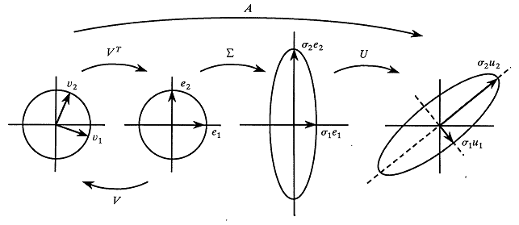
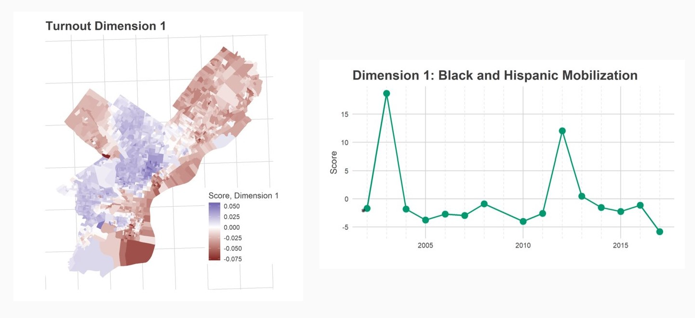

## Agenda

- Singular Value Decomposition
- Working Groups
- Brook Guzder-Williams from the World Resources Institute

---

## Looking Ahead

Next week: Final Presentations!

- Sign up!
- Please be on time.

April 29: Final Project Due

---

## Singular Value Decomposition

Suppose you have a big $N \times K$ matrix. How can you understand it?

$$
A = \begin{vmatrix}
3 & - & 5 & 3 & 2 \\ 
4 & 3 & - & 2 & 1 \\ 
3 & 5 & 9 & 2 & 4 \\ 
1 & 4 & 0 & - & 9 
\end{vmatrix}
$$

What are some examples?

\pause

- Netflix: Rows are users, columns are movies.
- Elections: Rows are Precinects, columns are Candidates.
- Demographics: Rows are Tracts, columns are income, race, age.

---

## Singular Value Decomposition

Suppose you have a big $N \times K$ matrix. How can you understand it?

$$
A = \begin{vmatrix}
3 & - & 5 & 3 & 2 \\ 
4 & 3 & - & 2 & 1 \\ 
3 & 5 & 9 & 2 & 4 \\ 
1 & 4 & 0 & - & 9 
\end{vmatrix}
$$

What tasks can you accomplish?

\pause

- Fill in missing values (assuming missing at random)
- Component analysis ("dimensionality reduction")
- Simplify patterns
- Predict new rows or columns

---

## Singular Value Decomposition

Singular Value Decomposition approximates matrix $A$ with

$A = U D V'$

- $A$ has dimensions $N \times K$.
- $U$ has dimensions $N \times M$.
- $D$ is a diagonal matrix $M \times M$.
- $V$ has dimensions $K \times M$.
- $U$ and $V$ are orthonormal.

---

## Singular Value Decomposition

Singular Value Decomposition approximates matrix $A$ with

$A = U D V'$

From https://blogs.sas.com/content/iml/2017/08/28/singular-value-decomposition-svd-sas.html

---

## Singular Value Decomposition

Singular Value Decomposition approximates matrix $A$ with

$A = U D V'$

$$
A = \begin{vmatrix}
U_{11} & U_{12} \\ 
U_{21} & U_{22} \\ 
U_{31} & U_{32} \\ 
U_{41} & U_{42} \\ 
\end{vmatrix}
\begin{vmatrix}
D_{11} & 0 \\
0 & D_{22}
\end{vmatrix}
\begin{vmatrix}
V_{11} & V_{21} & V_{31} & V_{41} \\ 
V_{12} & V_{22} & V_{32} & V_{42} \\ 
\end{vmatrix}
$$

- U is components of the rows.
- V is components of the columns.
- D is in order of captured variance. Trimming D increases smoothing.

- Each row and each column gets a score in each dimension.
- Dimensions are orthogonal.
- Observation $A_{ij}$ is estimated as $U_{i1} V_{j1} D_{11} + U_{i2} V_{j2} D_{22} + ...$

---

## Turnout Dimensioons

$U_{i1} V_{j1} D_{11} + U_{i2} V_{j2} D_{22} + ...$

---

## Demo

---

## Working Groups

a. Python
a. R
a. Deployment (scraping, automating)
a. Methodology (Risk Scores, Regressions)
a. Paper writing (Question, Lit Review, etc.)

